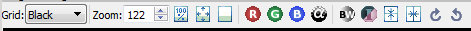
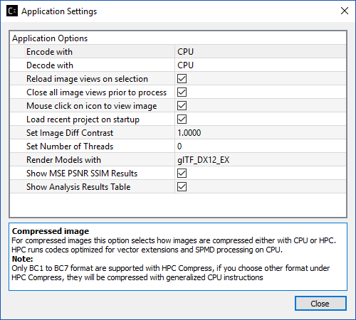
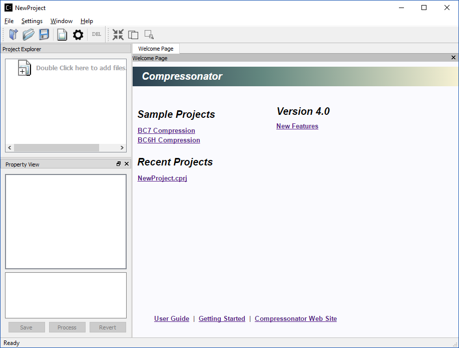
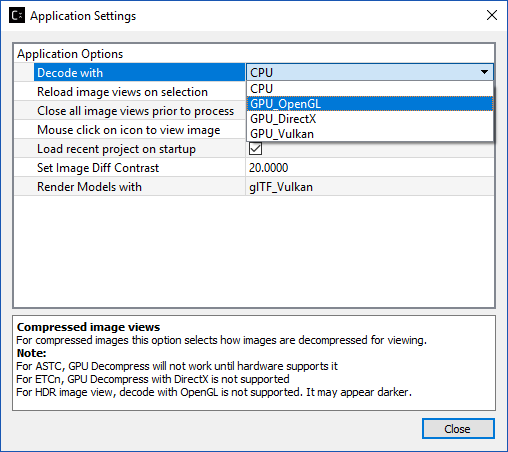
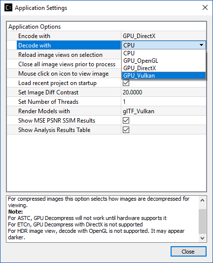
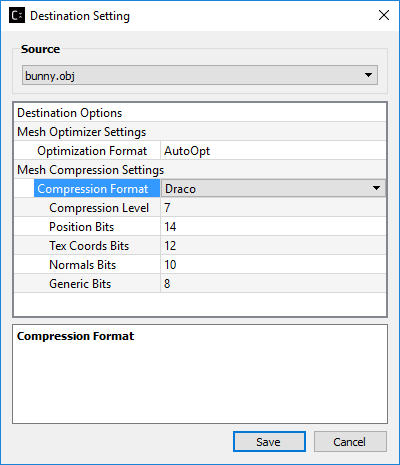


+--------------------+-----------------+
| Revision History   |                 |
+====================+=================+
| Version 3.0        | April 2018      |
+--------------------+-----------------+
| Version 2.7        | October 2017    |
+--------------------+-----------------+
| Version 2.5        | March 2017      |
+--------------------+-----------------+
| Version 2.4        | December 2016   |
+--------------------+-----------------+
| Version 2.3        | July 2016       |
+--------------------+-----------------+

Introduction
------------

This guide provides detailed information on the Compressonator GUI
application. It lists the requirement needed for running the application
and helps in installation, getting started with the tool, using the
sample projects and finding specific topics of interest.

**Compressonator GUI features**

-  The GUI interacts with Compressonator SDK for texture compression and
   bit format conversions; it can compress a wide range of compression
   formats including ASTC, ATC, ATInN, BCn, ETCn, DXTn, swizzle DXTn
   formats.

-  Supports conversion of textures with 32bit fixed and float formats.

-  Process multiple compression, decompression and transcode of images
   with a single processing action.

-  Allow multiple processing interactions for a single source image

-  Inspect visually and analytically compression results.

-  Uses a single image viewer that supports many compressed and
   uncompressed image formats.

-  Support 3D model file .obj and .gltf view and process the model file
   (optimize and/or compress mesh and/or compress textures within the 3D
   model).

Application Requirements
------------------------

-  Application was tested on Windows 7 and Windows 10 platform.

-  For best performance, a multi core CPU system with the latest AMD
   Graphics card are required.

-  For ease of use, a wheel based mouse is essential.

-  Use of multiple monitors is optional, and can be beneficial when
   examining multiple image views at the same time.

Installation
------------

-  To install the application, download the executable file from `GPU
   Open <https://github.com/GPUOpen-Tools/Compressonator/releases>`__ to
   your system. Then, double click the executable to start the
   installation process and follow the on-screen instructions.

-  Run the application in Administrator mode, recommended that UAC be
   turned off.

The Main Window
---------------

    Components of the main application

**Project Explorer**

Images and models are added to the application using the Project
Explorer.

2D texture image files are displayed in two levels, original source
image is shown on the left (branch item) and destination image(s) (sub
items) are shown on the right using a tree view outline.

3D model files (only support .obj and .gltf with .bin) are displayed in
three levels, original model is shown on the left (branch item) and
destination model is shown as 2\ :sup:`nd` level sub item while the
mesh/textures within the model is shown as 3\ :sup:`rd` level item of
the tree view.

**Property View**

Properties such as file size and image format of a selected item on the
Project Explorer are displayed on the Property View. Content of the
Property View changes when different items are selected in the
application.

**Image View**

An Image View is displayed when an item on the Project Explorer is
selected by mouse a single click on branch items or double click on sub
item.

**Message Output**

A message output window is displayed when an item on the Project
Explorer is processed for either compression, format transcoding or MIP
level generation.

It displays information on the process that was just performed and may
contain details such as performance, results or error(s) if a process
was unsuccessful.

Toolbars
--------

There are several types of tool bars. Depending on user preferences,
some can be moved to a new location on the application and other can
either be displayed or hidden by selecting the |image0| button.

**Note**: The Toolbar view setting is reset when the application is
restarted.

Application Toolbar
~~~~~~~~~~~~~~~~~~~

|image1|

+------------------------+-----------------------------------------------------------------------------------------------+
| |image2|               | Create a new project                                                                          |
+========================+===============================================================================================+
| |image3|               | Open an existing project file (project files have the extension .cprj)                        |
+------------------------+-----------------------------------------------------------------------------------------------+
| |image4|               | Saves any changes to the current project                                                      |
+------------------------+-----------------------------------------------------------------------------------------------+
| |image5|               | Open image files to add to the Project Explorer                                               |
+------------------------+-----------------------------------------------------------------------------------------------+
| |image6|               | Open an application settings dialog                                                           |
+------------------------+-----------------------------------------------------------------------------------------------+
| |image7|               | Delete the current selected items on the Project Explorer                                     |
+------------------------+-----------------------------------------------------------------------------------------------+
| |image8|               | Starts to process (Compresses, Decompresses or Transcodes)                                    |
|                        |                                                                                               |
|                        | If no items are selected it will auto select all items in the project.                        |
+------------------------+-----------------------------------------------------------------------------------------------+
| |image9|               | View image difference for a processed image (sub item) with the original image (branch item)  |
+------------------------+-----------------------------------------------------------------------------------------------+
| |image10|              | Generates MIP mapping to a specified minimum Mipmap level for original image (branch item)    |
+------------------------+-----------------------------------------------------------------------------------------------+

Image View Toolbar
~~~~~~~~~~~~~~~~~~

|image11|

+-----------------------+-------------------------------------------------------------------------------------------------------------+
| |image12|             | |image13|\ |image14|\ |image15|                                                                             |
|                       | Select the background the image is displayed on (default black)                                             |
+=======================+=============================================================================================================+
| |image16|             | Zoom into or out of the image using a specific scale (100 = original size) Min setting is 10 and Max is 9999|
+-----------------------+-------------------------------------------------------------------------------------------------------------+
| |image17|             | Displays the image at its original size                                                                     |
+-----------------------+-------------------------------------------------------------------------------------------------------------+
| |image18|             | Sets the image display to fit the current view                                                              |
+-----------------------+-------------------------------------------------------------------------------------------------------------+
| |image19|             | Restore the original image view to default                                                                  |
+-----------------------+-------------------------------------------------------------------------------------------------------------+
| |image20|             | Toggles the images Red channel on or off                                                                    |
+-----------------------+-------------------------------------------------------------------------------------------------------------+
| |image21|             | Toggles the images Green channel on or off                                                                  |
+-----------------------+-------------------------------------------------------------------------------------------------------------+
| |image22|             | Toggles the Images Blue channel on or off                                                                   |
+-----------------------+-------------------------------------------------------------------------------------------------------------+
| |image23|             | Toggles the Images Alpha channel on or off                                                                  |
+-----------------------+-------------------------------------------------------------------------------------------------------------+
| |image24|             | Toggles the image from (Black and White) to Color                                                           |
+-----------------------+-------------------------------------------------------------------------------------------------------------+
| |image25|             | Toggles inverting the images colors                                                                         |
+-----------------------+-------------------------------------------------------------------------------------------------------------+
| |image26|             | Mirrors the image horizontally                                                                              |
+-----------------------+-------------------------------------------------------------------------------------------------------------+
| |image27|             | Mirrors the image vertically                                                                                |
+-----------------------+-------------------------------------------------------------------------------------------------------------+
| |image28|             | Rotates the image clockwise by 90 Degrees                                                                   |
+-----------------------+-------------------------------------------------------------------------------------------------------------+
| |image29|             | Rotates the image counter clockwise by 90 Degrees                                                           |
+-----------------------+-------------------------------------------------------------------------------------------------------------+

Additional Toolbar options will be displayed when viewing certain type
of images, such as an image diff or images with multiple MIP levels

+-------------------------------------+---------------------------------------------------------------------------+
| |image30|                           | Increases the brightness of the image                                     |
|                                     |                                                                           |
+=====================================+===========================================================================+
| |image31|                           | Decreases the brightness of the image                                     |
|                                     |                                                                           |
+-------------------------------------+---------------------------------------------------------------------------+
| |image32|                           | Displayed when an image has multiple MIP Mapping (0 = original image).    |
|                                     | The view of any MIP level and size (as width x height) is selectable.     |
+-------------------------------------+---------------------------------------------------------------------------+

View Image Diff Toolbar
~~~~~~~~~~~~~~~~~~~~~~~

|image33|

+-----------------------------+-----------------------------------------------------------------------------------+
| |image34|                   | Displays an Image Difference to the left of two stacked images.                   |
|                             | Original on top and Processed Image at the bottom.                                |
+=============================+===================================================================================+
| |image35|                   | Organizes three image views (Original Image, Image Difference and Processed Image)|
|                             |                                                                                   |
|                             | in a horizontal line                                                              |
+-----------------------------+-----------------------------------------------------------------------------------+
| |image36|                   | The Property View displays Peak Signal Noise Ratio and Mean Square Error          |
|                             |                                                                                   |
|                             | for the processed image as compared to the original.                              |
|                             |                                                                                   |
|                             | **MSE** measures the cumulative squared error between the processed image and     |
|                             |                                                                                   |
|                             | original image. (Value of 0 = Original image)                                     |
|                             |                                                                                   |
|                             | **PSNR** measures the peak error in (dB) – (extremely high value = original image)|
+-----------------------------+-----------------------------------------------------------------------------------+
| |image37|                   | Structural Similarity Index (**SSIM**) measures a perceived quality factor from a |
|                             |                                                                                   |
|                             | scale of 0 (= No similarity) to 1 (= Original image).    |                        |
|                             |                                                                                   |
|                             | Each channel of the processed image is indexed with the original and then averaged|
|                             |                                                                                   |
|                             | to a single value.                                                                |
+-----------------------------+-----------------------------------------------------------------------------------+

Application Options
-------------------

Various default application behaviors can be set using the Application
Settings window. Select |image38| from the application tool bar or from
the Settings – Set Application Options menu

|image39|

Application Settings Window

Decode with
~~~~~~~~~~~

This option is a drop-down combo list where users can choose to decode
the image with CPU, GPU\_OpenGL, GPU\_DirectX or GPU\_Vulkan. It is used
when users click to view image on the Image View window.

Reload Image Views on Selection 
~~~~~~~~~~~~~~~~~~~~~~~~~~~~~~~~

This option when set will always close the current image view and open a
new image view. This is useful when an image has been processed to say a
new compression format and changed visually from when it was last
viewed. By default, this is turned on (check marked). If you turn this
option off then the view will not be refreshed every time you click on
viewing an image from the Project Explorer. Advantage of switching this
mode, is that for large compressed images the image view takes
considerable time to decompress and not necessary if the compressed file
content has not changed.

Close all Image Views Prior to Process
~~~~~~~~~~~~~~~~~~~~~~~~~~~~~~~~~~~~~~

This option when set will close all Image Views in the application,
prior to processing selected image destination settings in the Project
Explorer. This will free up system memory, to avoid out of memory issues
when processing large files.

Mouse click on icon to view image
~~~~~~~~~~~~~~~~~~~~~~~~~~~~~~~~~

This option is checked by default. When checked, the application will
load the image/model onto Image View window when user click on the icon
next to the image file node in the Project Explorer. When it is
unchecked (off), the application will load the image/model onto the
Image View window when user click on the image filename or icon.

Load Recent Project on Startup
~~~~~~~~~~~~~~~~~~~~~~~~~~~~~~

This option off by default, will load the last project you worked on.
This saves you time selecting it from the welcome page or the recent
files list from the file menu.

Projects
--------

The application uses a project based concept, where 2D texture images
are added to the Project Explorer tree view as original image items in
which settings are applied using a destination item. Each original 2D
texture image item can have multiple destination items. A destination
item can be set to generate a file with a specified format (compressed,
decompressed or transcoded) and extension (DDS, KTX, BMP, etc.)

While for 3D model items, they are added to the Project Explorer tree
view as original model items, in which multiple model destination
settings can be added as 2\ :sup:`nd` level tree which create multiple
resulted model items, the 3\ :sup:`rd` level destination setting which
applied to the mesh/texture items within the model can only be added
once per mesh/texture item.

Multiple destination items can be processed at the same time.

Projects can be loaded, created and saved to disk at any time.

Sample Projects
~~~~~~~~~~~~~~~

These samples can be accessed either from the Welcome Page or from the
sample projects folder

Compressonator\\Projects

+--------------------------+----------------------------------------------------------------------------------------------------------------------------+
| BC7\_Compression.cprj    | Project file demonstrating compression using BC7 on images with source extension formats of BMP, PNG, TGA and TIF          |
+==========================+============================================================================================================================+
| BC6H\_Compression.cprj   | Project file demonstrating compression using BC6H on a high dynamic range image (OpenEXR) file extension format of (EXR)   |
+--------------------------+----------------------------------------------------------------------------------------------------------------------------+

**Processing Ruby.bmp sample using BC7 Compression**

1. On the Welcome Page tab window as shown in the view below, click on
   “BC7\_Compression”

\ |image40|

The Project Explorer will change and show some sample images and
settings from the BC7 Compression sample project:

|image41|

1. Select the image by clicking on the name (for example, Ruby.bmp), the
   Properties View will now display information on the selected image’s
   location, various sizes, dimensions, etc.

|image42|

1. Now click on the right arrow next to the Ruby.bmp.

|image43|

This expands the view and you will see a clickable “Add destination
settings …” line and a BC7 pre-compressed destination sample
Ruby\_bmp\_1.

|image44|

1. Click on Ruby\_bmp\_1, and notice that the Property View changed (as
   shown below) to indicate what settings has been preset for
   Ruby\_bmp\_1

|image45|

Note that Compression Ratio and Compression Time both show “Unknown” and
“Not Processed”. These values will be updated when the destination file
is created during processing.

1. Click on the Process button located in the Properties View. Two new
   windows will open a Progress Window and a Message Output window. When
   processing is complete the progress window will close and the Output
   window will show a result.

|image46|

Notice also that there is a green circle next to Ruby\_bmp\_1,
indicating that a compressed file has been created and the process was
successful.

|image47|

1. To view the resulting file, double click on Ruby\_bmp\_1

|image48|

Properties
----------

The Properties View will display information on the selected image’s
location, various sizes, dimensions, etc.

|image49|

Property View Window

The Property View above shows that the selected image is set to compress
the original Ruby.bmp image using BC7 compression format, the expected
quality of the resulting image is shown as default 0.05, this value
ranges from 0 to 1. Lower quality values will have faster processing
time and less amount of precision when compared to the original image.

Warning: For some large images, setting quality values above 0.75, the
time to process it may take several hours for only a marginal increase
in overall quality when compared to the original image.

When a compression process is completed, the Property View will indicate
the time it took to compress the image and the Compression Ratio. To see
the Compression Ratio, click on compressed image in the Project
Explorer, this will update the Compression Ratio which indicates how
much the image was compressed compared to the original (typically 4x for
BC7)

|image50|

Property View Window showing Compression Ratio

Mip Map Generation
------------------

You can generate different MIP map level for the original image by
selecting the image (Ruby.bmp in this example) on the project explorer
and then click on the |image51|\ button on the Application Toolbar.

Note: Only one image can be selected for MIP map generation at one time.

A Generate MIP Maps window will appear.

|image52|

Select the desired Mip-Level for MIP map generation from the drop down
list. This drop down list is generated based on the selected original
image. Select the lowest mip-level you want to generate, then press the
Generate button.

|image53|

When MIP map generation completes, |image54| will appear in Image View
toolbar. Click on the little triangle to expand the drop down list.

|image55|

You can select the view of each MIP level from the list.

For example, selecting the level 3 (72x53) will update the current image
view as shown below

|image56|

Image View of Ruby BMP file at Mip Level 3

You can always re-generate MIP map for the same image by repeating the
all the steps mentioned in this section.

Viewing Images
--------------

The Image Viewer in combination with the Project Explorer allows users
to view a large variety of image formats. Ref `Adding Addition Image
Formats <#_Adding_additional_image>`__ on what formats are supported.

Note: In some cases viewing an image may take some time to display if
the CPU is used to decompress a large compressed image item.

-  To display an original image view, single mouse click on the item on
   the Project Explorer.

-  To display a destination item image view double click mouse on the
   Item on the Project Explorer.

|image57|

Image View of Ruby.bmp

To view a processed image (Project Explorer destination item with a
green circle), double click on it (Ruby\_bmp\_1 in this example) and you
will see another Image View tab window appear displaying the processed
image.

|image58|

BC7 Compressed Image View of Ruby\_bmp1.dds file

Using a Mouse Wheel for Zoom
~~~~~~~~~~~~~~~~~~~~~~~~~~~~

Rotating the mouse wheel in or out will also zoom the image in
increments of 10. To zoom at a faster rate (increments of 100) hold down
the keyboard Ctrl key and rotate the mouse wheel. Zoom will be centered
on the current mouse cursor location.

Using the Mouse to Move the Image in the View
~~~~~~~~~~~~~~~~~~~~~~~~~~~~~~~~~~~~~~~~~~~~~

To move the image around the view, place the mouse over the image and
press down the left mouse button. While keeping it pressed, move the
image around the view. To stop the move, release the left mouse button.

Note: you can only perform these operations when the mouse cursor is
over the image.

Detaching Windows from the Application
--------------------------------------

With the mouse position next to any gray shaded area next to the title
of the window, press down the left mouse key and at the same time slide
the mouse cursor away from the application. This will detach the window
and allow you to position it at a new location, either inside the
application or at a new desktop screen location. Once you have
positioned the window to where it is desired, simply release the left
mouse key.

Above are illustrations of where the mouse can be positioned for moving
the window.

Note: The Project View window is not moveable.

When the window is moved “Un-Docked” around the application a blue
shaded area will be displayed showing what new places the moved window
can be placed.

Window with Blue shaded application section.

Example of Window outside of the application.

The advantage of moving windows outside of the application is to provide
a larger viewing area for the image and allow side by side comparisons
when using multiple monitors.

Adding additional Image Formats
-------------------------------

There are a number of default image file formats that are supported by
the application

+--------------+----------------------------------+
| **Format**   | **Description**                  |
+==============+==================================+
| BMP          | Windows Bitmap                   |
+--------------+----------------------------------+
| PNG          | Portable Network Graphics        |
+--------------+----------------------------------+
| EXR          | High Dynamic Range Images        |
+--------------+----------------------------------+
| DDS          | Direct Draw Surface files        |
+--------------+----------------------------------+
| KTX          | Khronos Texture Files            |
+--------------+----------------------------------+
| TGA          | Targa Texture files              |
+--------------+----------------------------------+
| TIFF         | Tagged Image File Format files   |
+--------------+----------------------------------+

Support for EXR, DDS and KTX are linked into the main application and
cannot be overwritten

PNG and BMP are supported by QT (along with a number of other formats
PBM, PGM, PPM, XBM and XPM.)

TGA (24 bit uncompressed images) and TIF are supported by DLL’s in the
plugin folder AMD Compress\\plugins\\imageformats

Users can add additional file format by placing appropriate Qt Image
plugins into \\plugins\\imageformats folder.

Note: These DLL’s must support variations of decompressed images in
ARGB32 or ARGB32F

Add Destination Settings
------------------------

To add new destination settings a for specific original image (branch
item), expand its branch and select Add destination settings… by double
clicking on it.

|image59|

A new window will be displayed

|image60|

Add Destination Settings Window

Once you have set the desired options, the destination file name and
folder; select save. This will now add the new item to the Project
Explorer view.

|image61|

**Note:** In some cases, a red circle with a cross is displayed
indicating that a file already exists and will be overwritten with the
new settings. The current release does not check for duplications during
setting.

Compressing Images
------------------

Please refer to Getting Started document to get additional information
on how to use sample projects

After adding the `destination settings <#_Add_Destination_Settings>`__
for the image, select the preset setting and click on “Process” button
or right click over the preset setting and click Process <name of the
compressed file>

|image62|

If you want to process all the settings that are set for an original
image, right click over the root image and click Process all setting for
<Original image file name>. For instance, example below will process and
generate result for Ruby\_bmp\_1 and Ruby\_2.

|image63|

When compression process begins, a Progress window and an Output window
will appear.

|image64|

When the compression process completes, the Project Explorer will change
to indicate the status of the resulting compressed Ruby\_bmp\_1 image
with a small green (succeeded) or red circle (failed), and the Output
window will indicate additional information on the succeeded or failed
compression process.

|image65|

|image66|

Converting Image Formats
------------------------

Converting an image to a different format of similar or like quality
(Transcode)

1. Add the image to the project explorer

2. Add a new destination item setting with a format of ARGB\_8888
   (applies to most images) unless the original image is HDR in which
   case select ARGB\_32F.

   Note: The application cannot currently convert between source and
   destination variations of ARGB\_8888 and ARGB\_32F formats

3. Now set the desired destination file extension from the supported
   list

4. Process the destination item

Decompressing Textures
----------------------

Compressed images can be added to the project view as original items and
viewed with the Image Viewer.

|image67|

BC7 Compressed Image View of Ruby view as original image

Additional destination item settings can then be added to decompress the
original item to a new format such as BMP, PNG etc.

Note: Compressed images used as original image cannot be recompressed to
a new compressed destination, the selections are still enabled for
support in future versions.

In the example below, a BC7 compressed image ruby is uncompressed to
ARGB 8888 format and saved as a KTX file.

|image68|

Ruby DDS file saved as a KTX file

View Image Difference
---------------------

To view the difference between a processed image (Ruby\_bmp\_1) and
original image (Ruby\_bmp), right mouse button click on Ruby\_bmp\_1 and
select View Image Diff from the context menu or select the View Image
Diff Icon on the tool bar |image69|

|image70|

Mouse right mouse button click over Ruby\_bmp\_1 showing Context menu

You will now see a comparison of the original image with the compressed
image

|image71|

Image Difference view

Note: The windows in this view are not movable.

Analyzing Compressed Images
---------------------------

After clicking View Image diff, you can run analysis on the images that
show various statistics such as MSE, PSNR and Similarity Indices (SSIM)
by selecting |image72| on the top right corner of the image diff view.

When analysis process completed, the statistics result will be shown on
the Property View

|image73|

Improving Compression Quality
-----------------------------

The application allows multiple variation in processing a source image
with a number of different image compression techniques. Each having
specific quality and performance results.

By cycling different options between compress formats, quality setting
and examining the image differences and views, users can quickly
determine what works best for their image samples.

Batch Processing from Command Line Tool
---------------------------------------

Once a project has been setup, just like processing from the GUI you can
also setup processing using the CompressonatorCLI command line tool. The
Command line tool has more options that are currently not supported on
the GUI application. While 3D mesh process is not supported on Command
line tool yet.

Once the Batch file are generated from the GUI, it can be edited to
include more options used by the command line tool. This also
facilitates automated generation of compressed files from many source
textures.

Steps to generate a batch file:

-  Creating a project file and set up the desired destination settings.

-  Open the file menu and select “Export to batch file…”

-  Select a destination file name and location to generate a batch file
   that can be run from command line.

-  Select Save.

The batch file requires the CompressonatorCLI.exe, support file folders
and DLL to be present on the same location.

The following files are required to run CompressonatorCLI.exe with the
batch file:

… Include all files and subfolders under that folder

+-------------------------+---------------------------------------+
| \\plugins\\...          | Qt Windows DLL and Qt Image Plugins   |
+=========================+=======================================+
| CompressonatorCLI.exe   | Command line Application              |
+-------------------------+---------------------------------------+
| qt.conf                 | Specifies the plugin folder           |
+-------------------------+---------------------------------------+
| Qt5Gui.dll              | Qt Run time DLL’s                     |
+-------------------------+---------------------------------------+
| Qt5Core.dll             |                                       |
+-------------------------+---------------------------------------+
| libGLESv2.dll           |                                       |
+-------------------------+---------------------------------------+
| libEGL.dll              |                                       |
+-------------------------+---------------------------------------+

\`

GUI Channel weighting
---------------------

Channel weighting option (X Red, Y Green and Z Blue weighting) enabled
on compression destination setting for supported Compression Codecs.

|image74|

Users can edit the color channel weight ratio (total is 1.0000) by
editing the value on each channel. Each channel has their default value
(recommended value) set.

GUI Alpha setting enabled for BC1 (DXT1)
----------------------------------------

Alpha setting enabled for DXT1/BC1 compression

For DXT1/BC1 compression format, users can choose to enable/disable the
alpha channel in the compression. It is disabled by default.

|image75|

GUI HDR Properties setting 
---------------------------

HDR Properties setting enabled for half float and float type images (for
HDR view support)

For HDR floating point images, users can choose to adjust the exposure,
defog, and knee low as well as knee high properties of the display
images. It is disabled by default.

It can be enabled and shown by choosing the “HDR Properties…” from the
“View…” drop down list:

|image76|

After clicking on “HDR Properties…” the window below will pop up:

|image77|

ETC2
----

RGB texture compression based on ETC2 has been added to the
Compressonator SDK. The GUI and Command line tools both include ETC2
format that is based on GL\_COMPRESSED\_RGB8\_ETC2 API

Additional compression formats for ETC2 will be added in future
releases.

ASTC 
-----

ASTC compression and decompression of various block sizes from 4x4 to
12x12 has been added to the SDK. Viewing compressed ASTC images using
the OpenGL option requires GPU hardware that supports the ASTC format.
CPU based views have no hardware dependencies.

Note: DirectX 11 does not support viewing ASTC and ETC2 compressed
textures.

When ASTC is selected as a destination format, users can specify the
numerical compression bitrate (e.g. 8) or block number XxY (e.g. 4x4)
under the ASTC BlockRate section. Once specified, the closest bit rate
and the block number will be computed and shown in the info window. This
closest bit rate will be used for ASTC compression.

|image78| |image79|

Selectable GPU or CPU based compressed image views
--------------------------------------------------

You can select how compressed images are viewed on the GUI View image
tabs. The compressed textures are decompressed into RGBA\_8888 format
using either the Compressonator CPU based decompression algorithms or
the GPU via a common interface for OpenGL (version 3.3 and up) or
DirectX (only version 11 is supported).

Click on |image80| Set Application Options, Application Settings window
pops up as shown below:

Users can choose to view the compressed image using CPU or GPU.

|image81|

User can choose to decompress the image with OpenGL. DirectX or Vulkan
when GPU view is selected.

|image82|

After setting the application options, click on the compressed image to
view the image.

    Example views of compressed BC7 image ruby\_1.dds

**CPU View**

|image83|

**GPU View using OpenGL**

|image84|

**GPU View using DirectX**

|image85|

Users still able to generate image diff view with GPU as shown below:

|image86|

Cross platform support – Linux and Max build (CLI app and SDK only)
-------------------------------------------------------------------

Compressonator command line interface (CLI) app can be built cross
platform using the cmake and the shell scripts provided in
https://github.com/GPUOpen-Tools/Compressonator

Build instruction for Linux CompressonatorCLI app (Ubuntu 14.04 or 16.04
LTS only):

1. Sync down the source from
   https://github.com/GPUOpen-Tools/Compressonator.git

2. Navigate to the folder
   (Compressonator/Applications/CompressonatorCLI/Make/), run
   initsetup\_ubuntu.sh to install the required packages for command
   line app:

-  cmake at least 2.8.12

-  gcc-6 and g++-6 (v6.3.0)

-  glew and opengl (libglew-dev libegl1-mesa-dev)

-  qt5 at least 5.5.1

-  openexr v2.2

-  opencv v2.49

-  Boost at least 1.59 (filesystem and system lib)

1. runn buildCLI\_ubuntu\_cmake.sh to build (or rebuild) all the
   dependencies libraries with CompressonatorCLI executable generated in
   the same folder

2. (Optional) for more information on the cmake build, please refer to
   https://github.com/GPUOpen-Tools/Compressonator/blob/master/Compressonator/Applications/CompressonatorCLI/Make/readme.txt

glTF Viewer and asset compression 
----------------------------------

Compressonator GUI application now supports glTF V2.0 file formats for
viewing and processing. (Note: The CLI application does not support
processing these files and will be updated in future revisions) 

In order to use this feature the current V2.7 release requires **DX12
compatable HW and Drivers as well as Win10 RS2 or later**. 

You can check if your system fulfills this requirement by running
DirectX Diagnostic Tool (or dxdiag.exe) and refer to Win10 OS build
15063.xxx or later / Win 10 Version 1703 or later. Future releases will
add support for OpenGL.

You can check by running windows dxdiag.exe on your system and check
that it matches what is highlighted below.

|image87|

To use this feature,

***Step 1***: simply open a model with .gltf extension or drag and drop
the file from a file explorer to the GUI Projects Tree view panel as
shown below. The following steps is using the sample glTF file
(SciFiHelmet.gltf) downloaded from
https://github.com/KhronosGroup/glTF-Sample-Models/tree/master/2.0/SciFiHelmet

|image88|

Now that we have a .gltf source we can now add any number of new .gltf
files to use for processing. 

***Step 2***: Clicking on (>) shows additional setting 

|image89|

Double click on "Add gtTF destination settings" to allow copying the
original file to a new file for further processing. A Destination
Setting window will pop up as shown as below, this set up is used to
preserve the original file settings and allow users to change only
copies of it:

|image90|

On this new settings dialog, you can change the default destination file
name and folder then save 

 

***Step 3***: The project tree will now display the copied gltf file.
This copy still refers to the original sources images, cloud point data,
meshes etc...

|image91|

To view the 3D model simply click on the item or its icon, the 3D model
view will show up in the viewer panel as shown below:

|image92|

Note that the properties view has also been updated as shown above.

The 3D model view can be rotated and tilted by left mouse click and move
on the view. To scale, use the mouse wheel in or out.

Note: By design all 3D views from any source are synced with mouse moves
and scale.  To reset the views back to origin, click on the right mouse
button.

***Step 4***: Now that we have a copy of the original we are ready to
change the source assets to use compression. 

Clicking on (>) of the newly added glTF file to show additional setting.
Double click on "Add Destination Settings."  To show the Destination
Settings Dialog as shown below:

|image93|

The Source drop down list will show all the files that are available for
compression in the selected model.

 

|image94|

Select the source file, then set its destination and compression
settings.

Select save to mark the content of the gltf file "SciFiHelmet\_1.gltf"
to reference the new destination file.

|image95|

(Note since we have not yet processed the new compression settings the
contents of the copy have not been updated. It will only update when the
settings have been processed without any errors.)

***Step 5***: You can repeat “Step 4” process of "Add Destination
Settings for all or any number of the remaining texture files that are
not previously selected. Note that the Source drop down list in the
Destination Setting dialog will get smaller each time a file is selected
for processing as we only allow one format to be selected for each
texture within the glTF file. If you would like to try out different
format on the specific texture, please repeat Step 2 to 4.

***Step 6***: Right click on the tree item to process the new settings

 

|image96|

or select the process all icon\ |image97| on the tool bar.

***Step 7***: Once the process is complete and successful a new green
icon will be displayed. At this point the SciFiHelmet\_1.gltf file
reference to the new destination file
SciFiHelmet\_BaseColor\_PNG\_BC7\_1.dds file will be updated.

|image98|

glTF 3D Model Diff 
-------------------

To view a 3D model diff, select the model copy "SciFiHelmet\_1.gltf" and
right mouse click on it. A new menu will display showing "View 3DModel
Diff"

|image99|

Once selected and after a few seconds of processing time. You will see
the 3D Model image diff rendering of the original 3D model
"SciFiHelmet.gltf" and it’s Compressed Version "SciFiHelmet\_1.gltf"
alongside an animated render of both on the same view panel. 

3D Mesh Optimization and/or Mesh Compression
--------------------------------------------

Add 3D model file into Project Explorer by “Double click here to add
files…” (recommended) or drag and drop into the Project Explorer. After
that, click on the right arrow next to the model file added to expand
the clickable “Add model destination settings…” view. Click on “Add
model destination settings…” and click Save to add a resulted model file
node as 2\ :sup:`nd` level of the Project Explorer tree view.

|image100|

Note that you can add multiple 2\ :sup:`nd` level output node to the
Project Explorer tree.

After that, expand the 2\ :sup:`nd` level output node
(SciFiHelmet\_1.gltf) by clicking on the right arrow next to the node
and you will see the clickable “Add destination settings…”, click on
“Add destination settings…”, Destination Option window will pop up and
select a “Source” which are mesh (it will be a .bin file for glTF model
and .obj file itself for obj model). The Destination Option window will
be shown as below:

|image101|

By default, “AutoOpt” is selected, which will perform the best
optimization setting for the Model, you can override this setting by
selecting “UserOpt” and set accordingly as described below.

|image102|

Mesh Optimizer Settings for “UserOpt” selection
~~~~~~~~~~~~~~~~~~~~~~~~~~~~~~~~~~~~~~~~~~~~~~~

Optimize Vertex Cache
^^^^^^^^^^^^^^^^^^^^^

Optimize the cache utilization with LRU (least recently use) cache
replacement policy.

Cache Size
^^^^^^^^^^

Specifies the hardware vertex cache size for vertex cache optimization.
This cache size refers to GPU built-in fixed size cache that store
transformed vertices.

Optimize Vertex FIFO
^^^^^^^^^^^^^^^^^^^^

Optimize the cache utilization with FIFO (first in first out) cache
replacement policy.

FIFO Cache Size
^^^^^^^^^^^^^^^

Specifies the hardware vertex cache size for FIFO vertex cache
optimization. This cache size refers to GPU built-in fixed size cache
that store transformed vertices.

Optimize Overdraw
^^^^^^^^^^^^^^^^^

Reduce overdraw by reorder the triangles to render possible occludes
first. Recommended to perform overdraw after vertex optimization if
optimize vertex cache is checked. Overdraw optimization tries to
maintain a balance with vertex cache optimization using the input ACMR
Threshold.

ACMR Threshold
^^^^^^^^^^^^^^

Average Cache Miss Ratio = #transformed vertices/#triangles (lower mean
better vertex cache optimization). This is used for overdraw
optimization process to make sure the overdraw optimization does not
compromise vertex cache optimization. By default, it is set t0 1.05
(means resulting ratio at most 5% worse). Set to 3 to force overdraw
optimization perform sorting on all triangles.

Optimize Vertex Fetch
^^^^^^^^^^^^^^^^^^^^^

Reduce overfetch from vertex buffer. This process will be performed
after optimizing overdraw if optimize overdraw is enabled.

Simplify Mesh
^^^^^^^^^^^^^

Simplify the mesh by using 70% of the original index count and perform
edge collapse algorithm using quadric and quadric error calculation. The
target index count depends on the level of detail set by the user.

Level of Detail
^^^^^^^^^^^^^^^

Used in simplify mesh. Each level will use 70% of the index count on
previous level. The higher the level, the less detail appear on the
resulted mesh.

Mesh Compression Settings for Draco selection
~~~~~~~~~~~~~~~~~~~~~~~~~~~~~~~~~~~~~~~~~~~~~

When selected it will perform mesh compression using
`Draco <https://opensource.google.com/projects/draco>`__ encoder lib.
For Compressonator V3.0 this option is only available for obj files

|image103|

Compression Level
^^^^^^^^^^^^^^^^^

This is in range of 0-10. Higher number produces more compressed
(smaller) mesh. Default is set to 7.

Position Bits
^^^^^^^^^^^^^

Quantization bits used for vertices positions attribute. Default is set
to 14.

Tex Coords Bits
^^^^^^^^^^^^^^^

Quantization bits used for texture coordinate attribute. Default is set
to 12.

Normal Bits
^^^^^^^^^^^

Quantization bits used for normal vector attribute. Default is set to
10.

Generic Bits
^^^^^^^^^^^^

Quantization bits used for the other generic attribute. Default is set
to 8.

Selecting “NoOpt” will turn off Mesh Optimization and “NoComp” will turn
off Mesh Compression.

Click “Save” after completing the mesh optimizer and/or mesh compression
settings. You will see a 3\ :sup:`rd` level destination settings node
added to the Project Explorer as shown below:

|image104|

Right click on the 3\ :sup:`rd` level destination settings node and
select “Process <node name>” as shown below:

|image105|

A green circle will appear beside the destination settings node after
mesh optimization and/or compression completed.

Analyzing Mesh
--------------

Mesh analysis can be performed on the original model file as well as the
resulted model file (1:sup:`st` and 2\ :sup:`nd` level items in the tree
view of Project Explorer). Only .gltf and .obj files are supported for
mesh analysis.

After adding the model file to the Project Explorer, right click on the
file and select “Analyse Mesh Data” from the context menu:

|image106|

A 3D Mesh Analysis window will pop up as shown below:

\ |image107|

Analysis Vertex Cache
~~~~~~~~~~~~~~~~~~~~~

Vertex Cache Size
^^^^^^^^^^^^^^^^^

This is used to analyze vertex cache optimization. The vertex cache
should be set to match mesh optimizer vertex cache size. Usually range
between 16-32.

Warp Size (# of threads)
^^^^^^^^^^^^^^^^^^^^^^^^

Number of threads per wave front group in GPU scheduling. 64 by default.

Primitive Buffer Size
^^^^^^^^^^^^^^^^^^^^^

Triangle group size. Default is set to 128.

Analysis Vertex Fetch
~~~~~~~~~~~~~~~~~~~~~

Cache Line Buffer Size(bytes)
^^^^^^^^^^^^^^^^^^^^^^^^^^^^^

This is the cache line buffer size which can be retrieved by running
clinfo.exe in the window system. Default is set to 64.

Total Cache Buffer Size(bytes)
^^^^^^^^^^^^^^^^^^^^^^^^^^^^^^

This is the total cache buffer size which can be retrieved by running
clinfo.exe in the window system. Default is set to 128\*1024.

Analysis Overdraw
~~~~~~~~~~~~~~~~~

Orthographic X and Y View Max Value
^^^^^^^^^^^^^^^^^^^^^^^^^^^^^^^^^^^

Overdraw statistic is calculated from different orthographic camera view
start from 0. This set the maximum of X and Y viewport. Default is set
to 256.

After done setting the desired mesh analysis settings, click “Run Mesh
Analysis”, if you run mesh analysis from the source model file
(1:sup:`st` level tree item), the window will be updated with text
output as shown below:

|image108|

If you run mesh analysis from the resulted model file (2:sup:`nd` level
tree item), the window is updated with both resulted model file analysis
result as well as the original model file analysis result as shown
below:

|image109|

This is essential for users to compare between original and processed
model file mesh analysis.

Mesh Statistic
~~~~~~~~~~~~~~

ACMR (Average Cache Miss Ratio)
^^^^^^^^^^^^^^^^^^^^^^^^^^^^^^^

ACMR = #transformed vertices/#triangles. The average number of cache
miss per triangle is 0.5 in optimum case and 3.0 in worst case. Lower
mean better vertex cache optimization.

ATVR (Average Transform Vertices Ratio)
^^^^^^^^^^^^^^^^^^^^^^^^^^^^^^^^^^^^^^^

ATVR = #transformed vertices / vertex count. The optimum case is 1.0,
worst case is 6.0. Lower mean better vertex cache optimization.

Overdraw
^^^^^^^^

Overdraw = #pixels shaded/total pixels covered. The best case is 1.0
(each pixel is shaded once)

Overfetch
^^^^^^^^^

Overfetch = #bytes read from vertex buffer/total # bytes in vertex
buffer. The best case is 1.0 (each byte is fetched once)

Note: As mesh processing is model dependent. These mesh statistics shown
in mesh analysis can be used as a guideline to produce better mesh using
the `Mesh Optimizer Settings <#_Mesh_Optimizer_Settings>`__.

Image View switch between Original and Processed
------------------------------------------------

This feature allows users to switch quickly between Original Image View
and Processed Image View (Processed refers to Compressed Image View or
Pixels Difference Image View) by simple key stokes (O or P) or from the
Image View bar dropdown list. This allows users to have a visual
comparison between Original and Processed images.

After `compressing image <#_Compressing_Images>`__, click on the green
circle beside the compressed Image to generate the image view window as
shown below:

|image110|

Click on the Image View window to set focus, then hit “Space” bar to
switch between Original and Processed (In this case, Processed refers to
Compressed Image) Image Views. You can also switch between Processed and
and Original Views by select the related views from the combo drop down
list |image111|

To change the Processed Image View to Image Diff View, click on the icon
|image112| beside the |image113| , observed that Processed View now
shows Image Diff View (In this case, Processed refers to Image Diff),
you can switch between Original and Image Diff View by hitting the
“Space” bar. Note: You may need to increase the Image Brightness by
clicking on |image114| to view the Processed Image Diff.

To change the Processed Image View back to Compressed Image View, click
on the same icon |image115|.

Limitations
-----------

1. Current version does not keep the window position changes and is
   reset every time the application is restarted.

2. The zoom operation can only be performed when the mouse cursor is
   over the image.

3. Only one image can be selected for MIP map generation at a time.

4. For some large images, when setting quality values above 0.75, the
   time to process the image may take several hours for only a marginal
   increase in overall quality when compared to the original image.

5. In some cases, viewing an image may take some time to display when
   the CPU is used to decompress a large compressed image item.

6. The Project View window and each image in the Image Diff View window
   is not moveable.

7. Current version of the application cannot convert between source and
   destination variations of ARGB\_8888 and ARGB\_32F formats

8. Compressed images used as original image cannot be recompressed to a
   new compressed destination, the selections are still enabled for
   support in future versions.

9. You may encounter out of memory error in processing a large image
   based on the system specification.
   

Revision History
----------------

V3.0
~~~~

V3.0 release will expand Compressonator assets processing from 2D to 3D.
Please refer to Getting Started document (Section “Getting Started on 3D
Mesh Processing”) if you wish to have a quick start on V3.0.

**Features**

`3D Mesh Optimization <#_Optimizing_Mesh>`__

-  Optimize mesh (.obj model and .bin file from .glTF model) using
   vertex cache optimization, overdraw reduction and mesh simplification
   using level of details.

-  `Analyzing Mesh <#_Analyzing_Mesh>`__ : Provide ACMR (Average Cache
   Miss Ratio) and ATVR (Average Transformed Vertices Ratio) statistic
   from mesh optimization to analyze mesh optimization only.

`3D Mesh Compression <#_Optimizing_Mesh>`__

-  Compress mesh (support only .obj model) using Draco library.

    `Image View switch between Original and
    Processed <#_Image_View_switch>`__

-  Original Image View and Processed Image View (Compressed Image View
   or Pixels Difference Image View) can be switched with simple key
   stokes (O or P)

**Known issues and limitations** 

-  “Mesh optimization only support glTF and obj file format while mesh
   compression only support obj file format.

-  Embedded gltf is not supported for now. Only gltf with external .bin
   mesh file is supported.

-  .obj file texture load (with an external mtl file) and view is not
   supported.

-  “AutoOpt” in the mesh optimization setting may not produce the best
   result, it is just a default setting which includes vertex cache
   optimization with cache size of 16, overdraw optimization with ACMR
   threshold 1.05 and vertex fetch optimization. The mesh optimization
   setting is model-dependent and depend on actual hardware. If result
   is not optimized, users are advised to use “UserOpt” setting and
   refer to `Mesh Optimizer Settings for “UserOpt”
   selection <#_Mesh_Optimizer_Settings>`__ to set each value manually
   or check/uncheck certain optimization.

-  Mesh Optimization with all selected Mesh Optimizer Settings will need
   to work with `mesh analyzing <#_Analyzing_Mesh>`__ with the values
   set to match the hardware to get the optimum result.

-  KTX 3 color channels multiple mip level may result in GUI crash and
   will be fix in next release.

 
 
V2.7
~~~~

**Features**

-  `Linux and Mac support- <#_Cross_platform_support>`__ build with
   cmake and shell script

-  Preview of 3D model viewer and asset compression

   -  `Compress texture images within the glTF
      file <#_glTF_Viewer_and>`__.

   -  `View 3D Models with DX12 using glTF v2.0 <#_glTF_Viewer_and>`__
      file format https://www.khronos.org/gltf

   -  `Compare compressed model <#_glTF_3D_Model>`__ textures with
      original

**Known issues and limitations** 

-  “Drag and drop” does not work due to User Interface Privilege
   Isolation technology which forbid dragging from non-admin to admin,
   please relaunch the app without admin again if drag and drop does not
   work.

-  glTF viewer is pre-mature and requires DX12 feature level 12, support
   only Win10 RS2 or later, also Window SDK 10.0.15063.0 is recommended
   for best functionality of the viewer.

-  Decompress view with Vulkan only support up to driver version 1.5.0.
   Stay tune for update to support the latest driver.

-  Some glTF view might appear zoom in or out. Please use the mouse
   wheel to zoom in/out for better view.

|image116|

V2.5
~~~~

**Features**

-  GUI updates includes

-  `Added support for HDR image view <#_GUI_HDR_Properties>`__, a HDR
   properties window has been added to allow user adjust Exposure,
   Defog, Knee Low and Knee-High values.

-  `Added support for channel weight
   setting <#_GUI_Channel_weighting>`__ in destination setting window
   for compression codecs.

-  `Added support for alpha setting <#_GUI_Alpha_setting>`__ in
   destination setting window for BC1.

-  `Added option to select image view with GPU or
   CPU <#_Selectable_GPU_or>`__ (decompress with GPU or CPU).

-  GUI “Process” icon behavior has been changed for the convenience of
   the users:

   -  “Process” icon has been enabled all the time even when users do
      not add any compression setting to the original images.

   -  Allow user to drag and drop multiple images and click “Process”
      right away, in which GUI will set the compression setting chosen
      by the users to all original images.

-  Codecs updates includes

-  `ASTC <#_ASTC>`__

-  `ETC2 <#_ETC2>`__

-  Improved BC6H Compression quality

V2.4
~~~~

**Features**

-  Improved performance of ASTC compression

-  Performance adjusted according to quality settings

-  Fast multi-threaded implementation Example: Boat.png sample image
   with Quality = 0.05 and BitRate = 8.0 over 40% faster for single
   threaded compression compare with v2.3 35x faster for multi threaded
   (8 threads on a 8 Core CPU) compression

-  Support MipMap generation in KTX files

-  Added TGA image plugin

-  Added Vulkan GPU based decompression and viewing of compressed image

-  64-bit support added to Command Line and GUI applications

**Known issues and limitations** 

-  MipMap views is not supported in GPU based decompression

**Bug Fixes and Changes**

-  GUI application no longer requires GPUOpen CodeXL components

   -  Replaced Progress Bar

   -  Replaced About Box

   -  Replaced Welcome Page

   -  Removed Crash Reports

-  To build GUI and CLI applications from source, it is required to
   install Qt v5.7 first (Qt v5.5 in common folder is no longer
   required)

-  The path setting for 32 and 64 bit Qt files is set in a shared
   VisualStudio project file Compressonator\_RootDev.proj

-  Fixed the problem of corrupted BlockRate values in GUI when loading
   project files and processing

-  Fixed the corrupted image block problem when "BlockRate" width is not
   equal to height during ASTC CPU based decompression

-  Added check on valid ASTC user input block size (WxH) parameter

-  Fixed ATC\_RGB channel swizzle

-  Fixed missing decompressed image output to TGA file (replaced Qt
   plugins with Compressonator's own TGA plugin)

V2.3
~~~~

**Features**

`ETC2 codec for RGB textures <#_ETC2>`__

-  Compatible with OpenGL’s GL\_COMPRESSED\_RGB8\_ETC2 API

`ASTC <#_ASTC>`__ compression & decompression of various block sizes
from 4x4 to 12x12

-  Supported through OpenGL APIs

-  Requires GPU HW supports ASTC format

`Selectable GPU or CPU based compressed image
views <#_Selectable_GPU_or>`__

-  GPU rendering based on OpenGL or DirectX

`Channel weighting <#_GUI_Channel_weighting>`__

-  Enabled in Compression setting

`Alpha setting enabled for BC1 (DXT1) <#_GUI_Alpha_setting>`__

.. |image0| image:: media/image10.png
.. |image1| image:: media/image11.png
.. |image2| image:: media/image12.png
.. |image3| image:: media/image13.png
.. |image4| image:: media/image14.png
.. |image5| image:: media/image15.png
.. |image6| image:: media/image16.png
.. |image7| image:: media/image17.png
.. |image8| image:: media/image18.png
.. |image9| image:: media/image19.png
.. |image10| image:: media/image20.png

.. |image12| image:: media/image22.png
.. |image13| image:: media/image23.png
   :width: 0.71in
   :height: 0.71in
.. |image14| image:: media/image24.png
   :width: 0.71in
   :height: 0.71in
.. |image15| image:: media/image25.png
   :width: 0.7in
   :height: 0.7in
.. |image16| image:: media/image26.png
.. |image17| image:: media/image27.png
.. |image18| image:: media/image2.png
.. |image19| image:: media/image5.png
.. |image20| image:: media/image28.png
.. |image21| image:: media/image3.png
.. |image22| image:: media/image29.png
.. |image23| image:: media/image30.png
.. |image24| image:: media/image4.png
.. |image25| image:: media/image31.png
.. |image26| image:: media/image7.png
.. |image27| image:: media/image32.png
.. |image28| image:: media/image8.png
.. |image29| image:: media/image33.png
.. |image30| image:: media/image34.png
.. |image31| image:: media/image6.png
.. |image32| image:: media/image35.png
.. |image33| image:: media/image36.png
.. |image34| image:: media/image37.png
.. |image35| image:: media/image38.png
.. |image36| image:: media/image39.png
.. |image37| image:: media/image40.png
.. |image38| image:: media/image41.png

.. |image41| image:: media/image44.png
.. |image42| image:: media/image45.png
.. |image43| image:: media/image46.png
.. |image44| image:: media/image47.png
.. |image45| image:: media/image48.png
.. |image46| image:: media/image49.png
.. |image47| image:: media/image50.png
.. |image48| image:: media/image51.png
.. |image49| image:: media/image48.png
.. |image50| image:: media/image52.png
.. |image51| image:: media/image53.png
.. |image52| image:: media/image54.png
.. |image53| image:: media/image55.png
.. |image54| image:: media/image56.png
.. |image55| image:: media/image57.png
.. |image56| image:: media/image58.png
.. |image57| image:: media/image59.png
.. |image58| image:: media/image60.png
.. |image59| image:: media/image65.png
.. |image60| image:: media/image66.png
.. |image61| image:: media/image67.png
.. |image62| image:: media/image68.png
.. |image63| image:: media/image69.png
.. |image64| image:: media/image70.png
.. |image65| image:: media/image50.png
.. |image66| image:: media/image49.png
.. |image67| image:: media/image71.png
.. |image68| image:: media/image72.png
.. |image69| image:: media/image73.png
.. |image70| image:: media/image74.png
.. |image71| image:: media/image75.png
.. |image72| image:: media/image76.png
.. |image73| image:: media/image77.png
.. |image74| image:: media/image78.png
.. |image75| image:: media/image79.png
.. |image76| image:: media/image80.png
.. |image77| image:: media/image81.png
.. |image78| image:: media/image82.png
.. |image79| image:: media/image83.png
.. |image80| image:: media/image84.png

.. |image83| image:: media/image87.png
.. |image84| image:: media/image88.png
.. |image85| image:: media/image89.png
.. |image86| image:: media/image90.png
.. |image87| image:: media/image91.png
.. |image88| image:: media/image92.png
.. |image89| image:: media/image93.png
.. |image90| image:: media/image94.png
.. |image91| image:: media/image95.png
.. |image92| image:: media/image96.png
.. |image93| image:: media/image97.png
.. |image94| image:: media/image98.png
.. |image95| image:: media/image99.png
.. |image96| image:: media/image100.png
.. |image97| image:: media/image101.png
.. |image98| image:: media/image102.png
.. |image99| image:: media/image103.png
.. |image100| image:: media/image104.png
.. |image101| image:: media/image105.png
.. |image102| image:: media/image106.png

.. |image104| image:: media/image108.png
.. |image105| image:: media/image109.png
.. |image106| image:: media/image110.png
.. |image107| image:: media/image111.png
.. |image108| image:: media/image112.png
.. |image109| image:: media/image113.png
.. |image110| image:: media/image114.png
.. |image111| image:: media/image115.png
.. |image112| image:: media/image116.png
.. |image113| image:: media/image115.png
.. |image114| image:: media/image117.png
.. |image115| image:: media/image116.png
.. |image116| image:: media/image118.png
