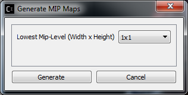
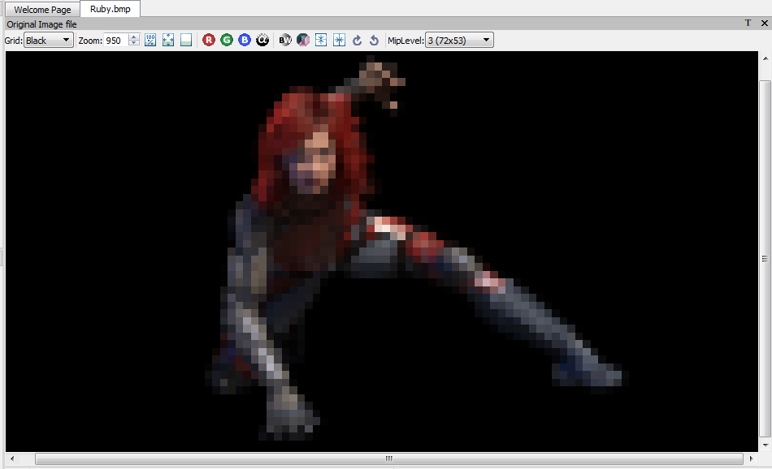

Mipmap Generation
------------------

Mipmaps can be generated for one or more source images in the Project Explorer by selecting the image(s) and clicking the "Generate Mipmaps" button |image51|\ in the Application Toolbar.

This will cause a dialog box to appear with some parameters related to mipmap generation.

|image52|

Select the minimum mipmap level size you desire from the drop-down list and press the "Generate" button.

The available mipmap sizes changes based on a few different variables. By default, all supported sizes for the current selected image will be display. If you have chosen to generate mipmaps using the GPU in the Application Options then only sizes divisible by 4 will be shown. Finally, if multiple images are selected a set of "standard" sizes will be shown and you should choose the one closest to your desired goal.

|image53|

When mipmap generation completes, |image54| will appear in Image View
toolbar. Click on the little triangle to expand the drop down list.

|image55|

You can select the view of each mipmap level from the list.

For example, selecting the level 3 will update the current image
view as shown below

|image56|

*Image View of Ruby BMP file at Mip Level 3*

You can always re-generate mipmaps for the same image by repeating all the steps mentioned in this section.

Mipmap Filter Support Using either GPU or CPU
----------------------------------------------

The GUI applications “Generate Mipmaps” option can be used on a variety of image formats to produce mipmaps filtered for optimal GPU or CPU use.

Options for using a Compressonator Box filter or DirectX® based filters are provided.

|image436|

Applying Gamma to Mipmaps
--------------------------

Gamma correction can be applied to the image pixels after mipmap generation by changing the default 1.0 value higher (darken the image) or lower (brighten the image).

GPU Based Compression and Mipmap generation
--------------------------------------------
An alternative option to generate mipmap levels is provided using the application setting window.
A feature to encode textures using just the GPU hardware and its driver components is provided. The encoding process uses no user application shader code to process the textures. 
Both the GUI and Command-line tools can run BCn GPU extensions provided by most GPU vendors and can be used to evaluate the quality and performance of encoded images using the image views and analysis setting.

Just enable the GUI “Application Settings” options to set the encoding with GPU and optionally set generating GPU based mipmaps as shown:

|image437|

|image438|

Once the images are processed users can view the quality of the resulting images with the applications image view PSNR feature,

Cube Maps
---------
Cube Maps can be compressed with or without mipmap levels. Only a limited set of texture types (RGBA_8888 and RGBA_F16) are currently supported in DDS and KTX file formats. Compressing, generating mipmap levels, and viewing cube maps uses the same process as image textures. Just place the file onto the Project Explorer and process them as required.

A new notation is used for the cube faces labeled as “Frames” for each cube face. For cube mapped files maximum frames is set to 6. Support for volumetric texture files is been reviewed and the frames limit will be expanded as needed.

When textures are added to the Project Explorer, the properties view will now display the type of texture as either a 2D or Cube Map, The Depth field is used for the frames size, the Depth field will also be used to indicate the z component of a 3D image (These notations may change in future revisions).

|image131|

View Image Difference
---------------------

To view the difference between a processed image (Ruby\_bmp\_1) and
original image (Ruby\_bmp), right mouse button click on Ruby\_bmp\_1 and
select View Image Diff from the context menu or select the View Image
Diff Icon on the tool bar |image69|

|image70|

Mouse right mouse button click over Ruby\_bmp\_1 showing Context menu

You will now see a comparison of the original image with the compressed
image

|image71|

Image Difference view

Note: The windows in this view are not movable.

Analyzing Compressed Images
---------------------------

After clicking View Image diff, you can run analysis on the images that
show various statistics such as MSE, PSNR and Similarity Indices (SSIM)
by selecting |image72| on the top right corner of the image diff view.

When analysis process completed, the statistics result will be shown on
the Property View

|image73|

.. |image51| image:: media/image53.png

.. |image53| image:: media/image55.png
.. |image54| image:: media/image56.png
.. |image55| image:: media/image57.png

.. |image69| image:: media/image73.png
.. |image70| image:: media/image74.png
.. |image71| image:: media/image75.png
.. |image72| image:: media/image76.png
.. |image73| image:: media/image77.png
.. |image116| image:: media/image118.png
.. |image131| image:: media/cubemaps.png
.. |image436| image:: media/image436.png
.. |image437| image:: media/appsettings1.png
.. |image438| image:: media/appsettings2.png

